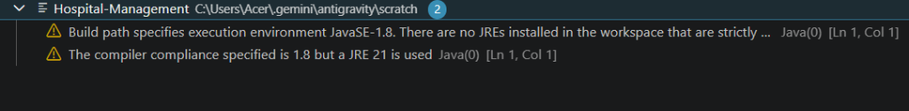
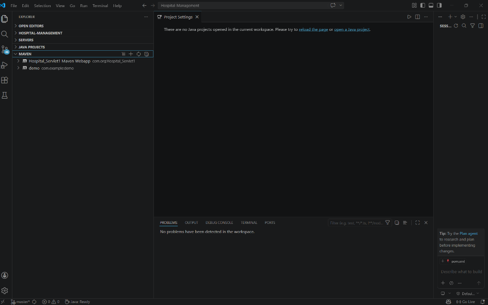
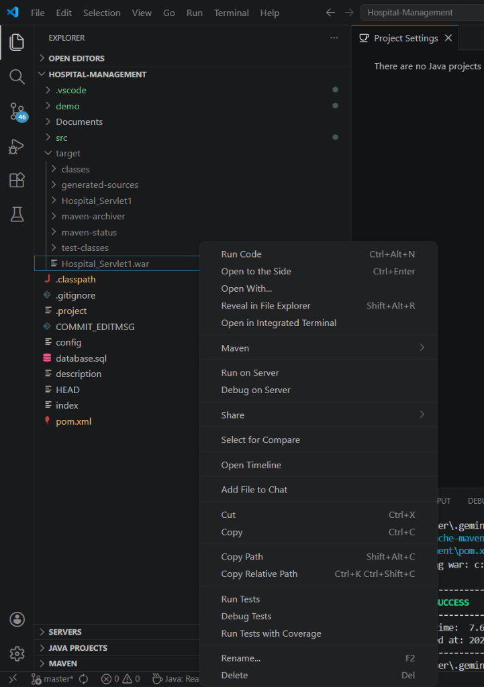
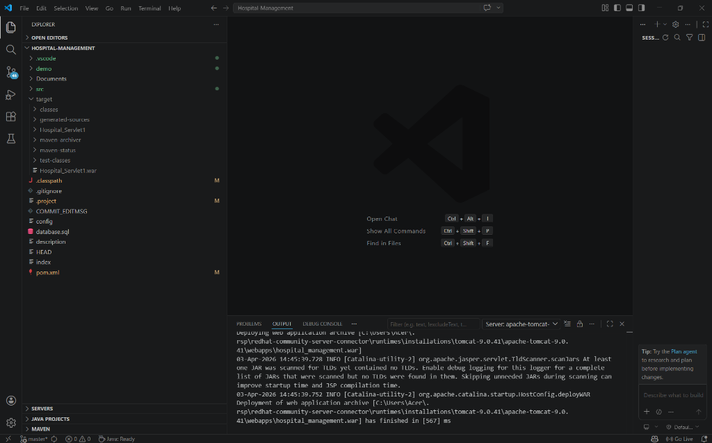

# Hospital Management System - Premium Redesign

A feature-rich, professional Hospital Management System built with Java, Servlets, and JSP, featuring a high-end "Google-style" aesthetic.

## 🚀 Vision
This project transforms a functional medical management prototype into a world-class digital experience. It combines robust backend logic with a modern, glassmorphic UI to provide a seamless interaction for patients, doctors, and administrators.

## ✨ Key Features
- **Modern Landing Page**: Bento-style grid layout with smooth scroll animations (AOS).
- **Patient Portal**: Easy appointment booking, history viewing, and profile management.
- **Doctor Dashboard**: Manage patient consultations, update statuses, and view schedules.
- **Admin Command Center**: Data-driven dashboard with real-time statistics (Doctor/Patient/Appointment counts).
- **Glassmorphism Design**: Crystal-clear components with backdrop filters for a premium feel.
- **Responsive Layout**: Optimized for all devices using Bootstrap 5.

## 📸 Screenshots





## 🛠️ Technical Stack
- **Backend**: Java 8 (Servlets, JSP, JDBC)
- **Frontend**: HTML5, CSS3, JavaScript, Bootstrap 5
- **Animations**: AOS (Animate on Scroll)
- **Database**: MySQL 5.7+
- **Build Tool**: Apache Maven 3.9+
- **Server**: Apache Tomcat 9.0+

## ⚙️ Getting Started

### 1. Database Setup
- Import the provided `database.sql` into your MySQL server.
- Ensure your database credentials in `com.db.DBConnect` match your environment.

### 2. Local Deployment
1. Clone the repository:
   ```bash
   git clone https://github.com/Devyansh2005/Hospital-Management.git
   ```
2. Build the project with Maven:
   ```bash
   mvn clean package
   ```
3. Deploy the `Hospital_Servlet1.war` file to your **Apache Tomcat** `webapps` folder.
4. Access the site at: `http://localhost:8080/hospital_management/`

## 🔐 Sample Credentials

| Account Type | Email | Password |
| :--- | :--- | :--- |
| **Administrator** | `admin@gmail.com` | `admin` |
| **Doctor** | *(Register via Admin)* | *(Set via Admin)* |
| **Patient** | *(Register via Signup)* | *(Set via Signup)* |

---
*Built with ❤️ for professional healthcare management.*
